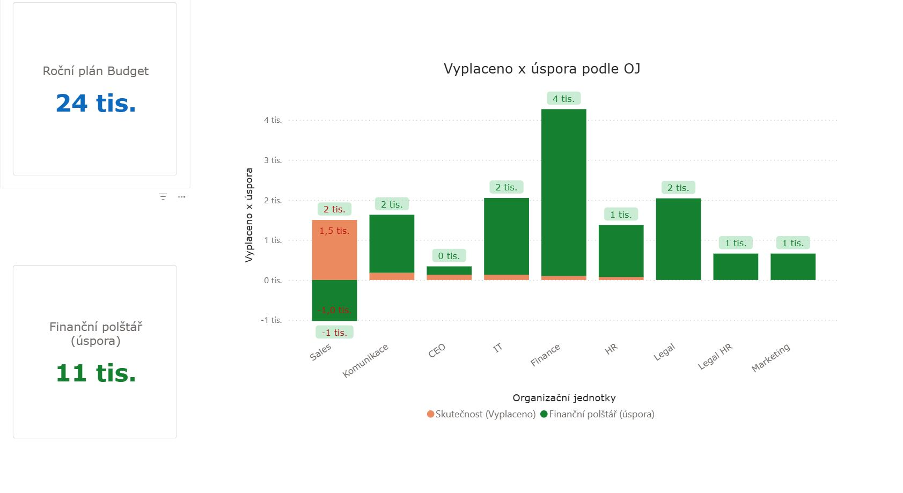
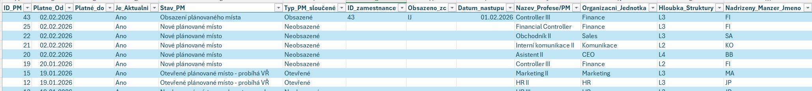
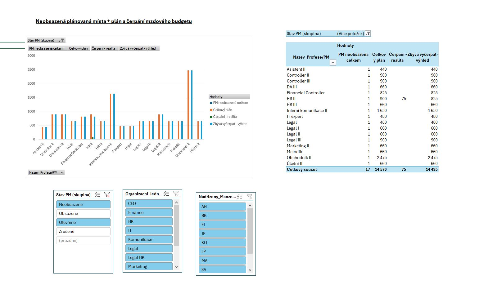
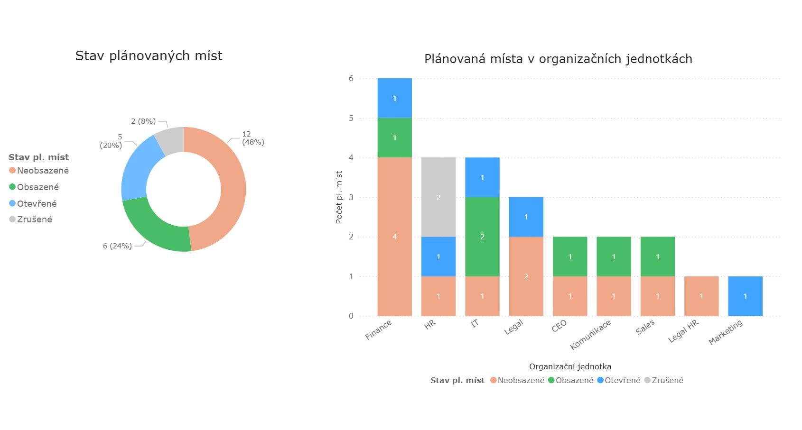

## 🏎️ Project Ferrari: Automatizované řízení mzdových nákladů a plánování pracovních míst

Tento projekt představuje komplexní analytické řešení pro správu pracovních míst obsazených i neobsazených včetně nastavení mzdových údajů (Evidence PM) a jejich automatizované porovnávání se skutečným čerpáním personálních nákladů z controllingu. 
Cílem bylo vytvořit chybějící systém evidence plánovaných míst, nahradit manuální přepisování dat robustním systémem, který eliminuje chyby a poskytuje manažerům okamžitý přehled o budgetu.

Systém pracuje s modulární architekturou. Je možné využít pouze část na evidenci plánovaných pracovních míst anebo evidenci budgetu na organizační jednotky. 
Celé řešení je postaveno tak, aby se dalo snadno v budoucnu rozšířit o další parametry, aniž by došlo k předělávání. Zároveň nevyžaduje náročné vstupní investice do komplexních softwarů. Vše je postaveno v ekosystému Microsoftu. 


## 🌟 Hlavní přínosy řešení
Automatizace 100% workflow: Data tečou z MS Forms přímo do analytického modelu bez nutnosti lidského zásahu.

Dynamický výpočet budgetu: Model v Power Query (M language) inteligentně počítá mzdové náklady s ohledem na:

 - Změny mezd, JG a Levels v průběhu roku.

 - Alikvotní části budgetu při zrušení nebo novém vzniku pracovního místa.

 - Historické vs. aktuální obsazení pozic.

 - Integrace Plán vs. Realita: Automatické párování plánovaných nákladů na konkrétní ID pracovníka z controllingových reportů.

## 🛠️ Technické parametry (Stack)
 - Source Data: MS Forms, SharePoint (Excel Online).

 - Engine: Power Query (M Language) – pokročilé transformace, deduplikace na základě časových razítek a ošetření chybových stavů.
   
### Ukázka logiky v M-Language (Power Query)
Aby byl model robustní, implementovala jsem dynamické seskupování stavů PM pomocí vyhledávání klíčových slov v textu, což eliminuje chyby při ručním zadávání dat:


```powerquery
#&quot;Podmíněný sloupec Typ_PM&quot; = Table.AddColumn(#&quot;Vypočtený Budget&quot;, &quot;Typ_PM_sloučené&quot;, each 
    if Text.Contains([Stav_PM], &quot;Otevřené&quot;) then &quot;Otevřené&quot; 
    else if [Stav_PM] = &quot;Obsazení plánovaného místa&quot; then &quot;Obsazené&quot; 
    else if [Stav_PM] = &quot;Zrušení plánovaného místa&quot; then &quot;Zrušené&quot; 
    else &quot;Neobsazené&quot;)

 ```

"Ukázka kódu v editoru Power Query"


 - Reporting: Excel Dashboard (Pivot Tables, Slicers) & Power BI.
   
„Interaktivní Power BI dashboard pro vizualizaci plánování, predikce a čerpání mzdových nákladů.“




## 🧩 Co jsem musela vyřešit (The "Analyst's Journey")
Během vývoje jsem čelila několika technickým výzvám, které dělají model robustním:

 - Logika unikátního záznamu: Implementace indexů pro zachování historie změn na jednom pracovním místě při zachování unikátnosti pro aktuální reporting.

 - Hierarchy of Truth: Vytvoření prioritního systému pro výběr mzdy (Upravená mzda > Nástupní mzda > Průměr mzdového rozpětí).

 - Časová inteligence: Ošetření výpočtů pro pozice, které zanikají dříve než 31. 12., aby nedocházelo k nadhodnocování forecastu.



## 📊 Dashboard Preview pro vizualizaci plánování pracovních míst

"Vizualizace v Excelu"


"Vizualizace v Power BI"



## 🔒 Autorská práva a licenční podmínky
Tento projekt (včetně metodiky výpočtu rozpočtu, logiky v Power Query a vizuálního zpracování) slouží jako ukázka mé odborné práce v rámci profesního portfolia. 

* **Vlastnictví:** Veškerá práva k tomuto řešení jsou vyhrazena autorce (Petra Kubálková).
* **Užití:** Projekt je určen výhradně k nahlédnutí pro účely prezentace mých dovedností. Jakékoli kopírování, komerční šíření, prodej nebo úprava kódu a metodiky bez předchozího písemného souhlasu autorky není dovoleno.
* **Kontakt:** V případě zájmu o implementaci podobného řešení ve vaší společnosti mě prosím kontaktujte prostřednictvím zprávy na GitHubu nebo LinkedIn.


