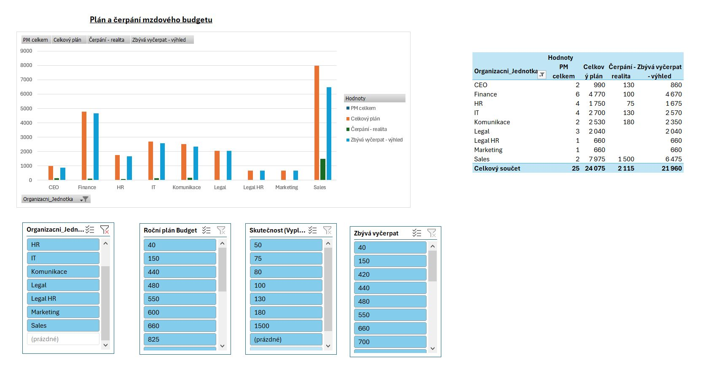
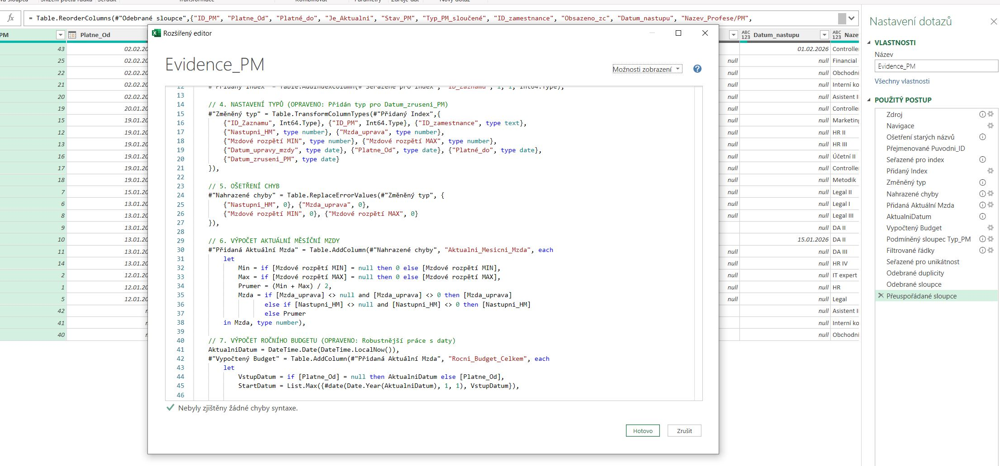

## 🏎️ Project Ferrari: Automatizované řízení mzdových nákladů a plánování pracovních míst

Tento projekt představuje komplexní analytické řešení pro správu pracovních míst obsazených i neobsazených včetně nastavení mzdových údajů (Evidence PM) a jejich automatizované porovnávání se skutečným čerpáním personálních nákladů z controllingu. 
Cílem bylo vytvořit chybějící systém evidence plánovaných míst, nahradit manuální přepisování dat robustním systémem, který eliminuje chyby a poskytuje manažerům okamžitý přehled o budgetu.

## 🌟 Hlavní přínosy řešení
Automatizace 100% workflow: Data tečou z MS Forms přímo do analytického modelu bez nutnosti lidského zásahu.

Dynamický výpočet budgetu: Model v Power Query (M language) inteligentně počítá mzdové náklady s ohledem na:

 - Změny platových tříd v průběhu roku.

 - Alikvotní části budgetu při zrušení nebo novém vzniku pracovního místa.

 - Historické vs. aktuální obsazení pozic.

 - Integrace Plán vs. Realita: Automatické párování plánovaných nákladů na konkrétní ID pracovníka z controllingových reportů.

## 🛠️ Technické parametry (Stack)
 - Source Data: MS Forms, SharePoint (Excel Online).

 - Engine: Power Query (M Language) – pokročilé transformace, deduplikace na základě časových razítek a ošetření chybových stavů.
 - 
### Ukázka logiky v M-Language (Power Query)
Aby byl model robustní, implementovala jsem dynamické seskupování stavů PM pomocí vyhledávání klíčových slov v textu, což eliminuje chyby při ručním zadávání dat:

#powerquery
#"Podmíněný sloupec Typ_PM" = Table.AddColumn(#"Vypočtený Budget", "Typ_PM_sloučené", each 
    if Text.Contains([Stav_PM], "Otevřené") then "Otevřené" 
    else if [Stav_PM] = "Obsazení plánovaného místa" then "Obsazené" 
    else if [Stav_PM] = "Zrušení plánovaného místa" then "Zrušené" 
    else "Neobsazené")

 - Reporting: Excel Dashboard (Pivot Tables, Slicers) & Power BI (připravuje se).

## 🧩 Co jsem musela vyřešit (The "Analyst's Journey")
Během vývoje jsem čelila několika technickým výzvám, které dělají model robustním:

 - Logika unikátního záznamu: Implementace indexů pro zachování historie změn na jednom pracovním místě při zachování unikátnosti pro aktuální reporting.

 - Hierarchy of Truth: Vytvoření prioritního systému pro výběr mzdy (Upravená mzda > Nástupní mzda > Průměr mzdového rozpětí).

 - Časová inteligence: Ošetření výpočtů pro pozice, které zanikají dříve než 31. 12., aby nedocházelo k nadhodnocování forecastu.

## 📊 Dashboard Preview
(Bude doplněno).

